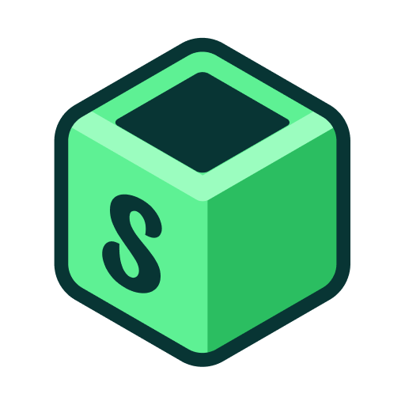

# 🧩 Sandboxed Assets


This repository contains official **assets** for the [Sandboxed](https://github.com/sboxed/sandboxed) project —  
a Flutter tool for developing, testing, and showcasing UI components in isolation.

It includes:

- ✅ Logos in PNG and SVG format
- ✅ App icons, favicons, and social preview images
- ✅ Brand color references and usage examples
- ✅ Promotional visuals and templates

---

## 📂 Directory Overview

```
/logos/ → Primary logo files (light/dark variants, flat)
```

---

## 🖼️ Logo Preview



> ✅ Green cube with stylized “S” representing modular UI  
> ✅ Modern, minimal, developer-focused visual identity

---

## 🧠 About Sandboxed

[Sandboxed](https://github.com/sboxed/sandboxed) is a Flutter-native component development environment —  
like Storybook, but built for Dart and Flutter.

---

## 📨 Contact

For asset usage questions or permission inquiries:  
**amelvspace@gmail.com**
